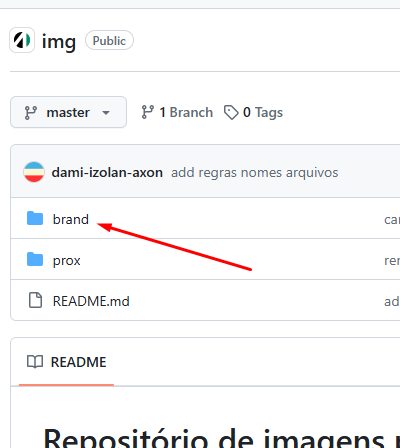
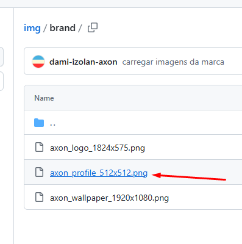
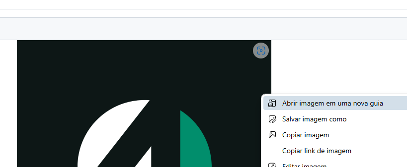
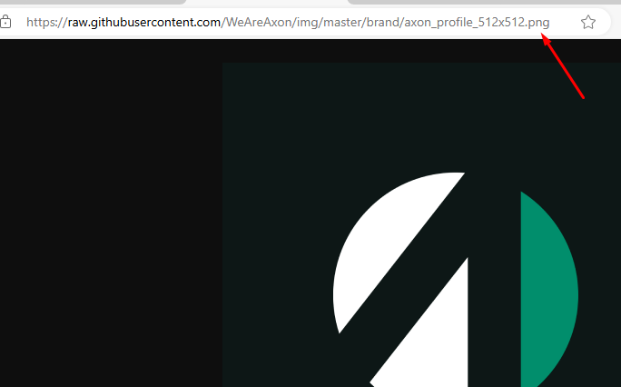

# Repositório de imagens públicas da Axon

### ⚠️⚠️⚠️ **_Atenção: Este é um repositório público_** ⚠️⚠️⚠️

Utilizar esse repositório quando precisar de um link público para alguma imagem (de preferência pequena). Por exemplo: imagem para assinatura de e-mail.

## Regras

- Enviar as imagens via Pull Request
- Manter organizado por pastas

### Nomes dos arquivos

> ⚠️ **Importante:** Evitar renomear arquivos depois de já terem sido carregados para o repositório e utilizados em algum lugar.

- Adicionar informações sobre a imagem no nome do arquivo (tamanho em pixels, cor do fundo etc.)
  - Ex.: `axon_logo_1920x1080_transparent_pos.png`
    - **1920** pixels de largura
    - **1080** pixles de altura
    - Fundo **transparente**
    - Esquema de cores **positivo**     
- Todos os caracteres minúsculos, se possível – utilizar `snake_case`
- Deixar o mais descritivo possível

## Como pegar o link público

### 1. Localizar a imagem

### 2. Botão direito > Abrir imagem em uma nova guia

### 3. Copiar o link da barra de endereços

